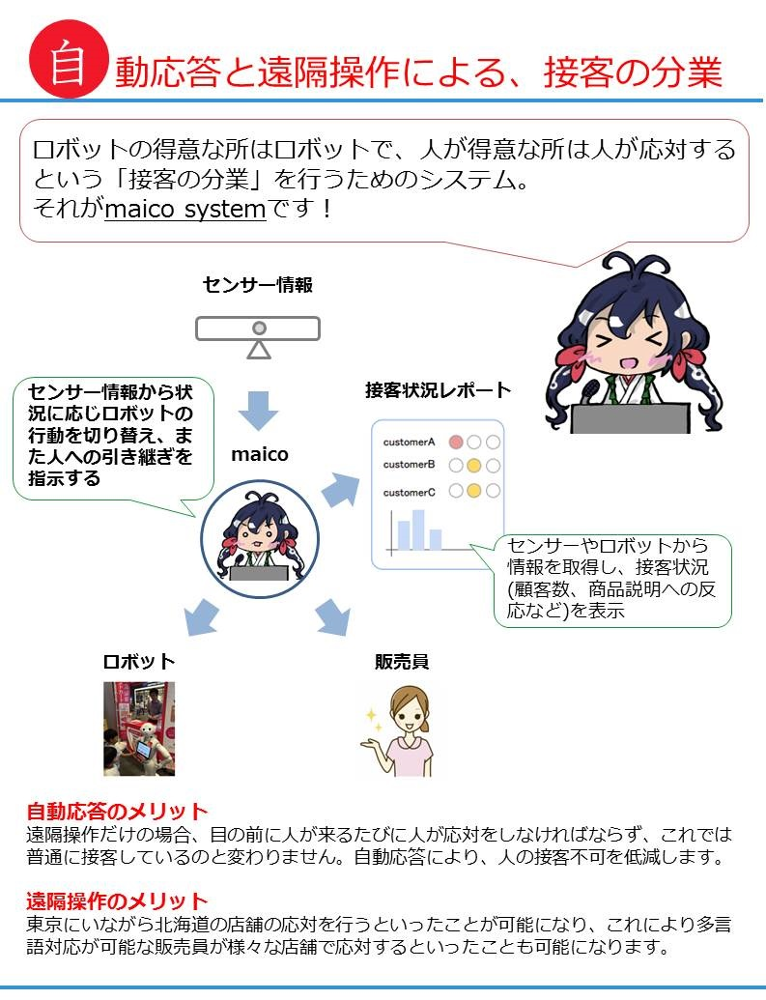

# maico

Human and Robot cooperation system for customer.

[link to documentation](https://github.com/tech-sketch/maico/tree/master/doc)

[demo movie](https://youtu.be/HdYe2GcFGdc)

# Install

maico, especially sensing module uses Kinect.  
So you have to run it on Windows, and install below dependencies.

* [PyKinect2](https://github.com/Kinect/PyKinect2)
* [pygame](http://www.pygame.org/download.shtml)

# Running

maico is constructed by below modules.

* model: machine learning model to switch the robot actions and human operation.
* operator: abstracted layer to manipulate robot.
* protocol: definition of data format between each modules.
* sensor: sensing the customer's behavior
* server: use interface (information dash-board) for human

To run the maico, run below script.

* user interface: `python run,py --mode=U`, then access to `http://localhost:8080`
* sensing module: `python run,py --mode=S`

(You have to start user interface server before the sensing module).  
You can make the training data for model by using sensor module.  Please access `http://localhost:8081` to do it.

