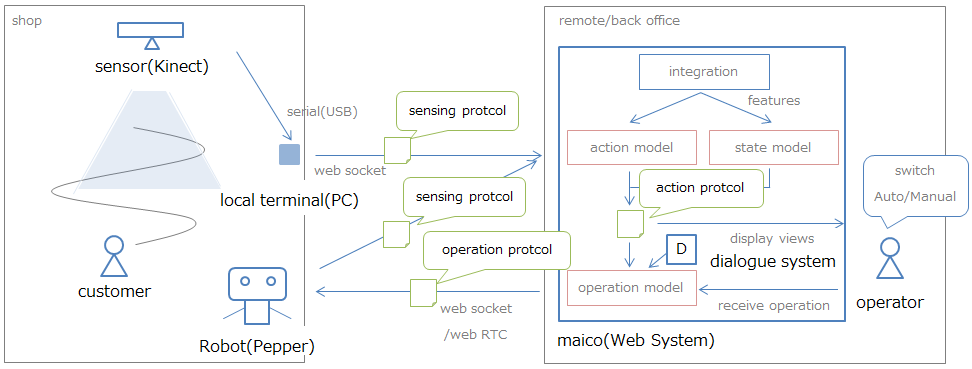
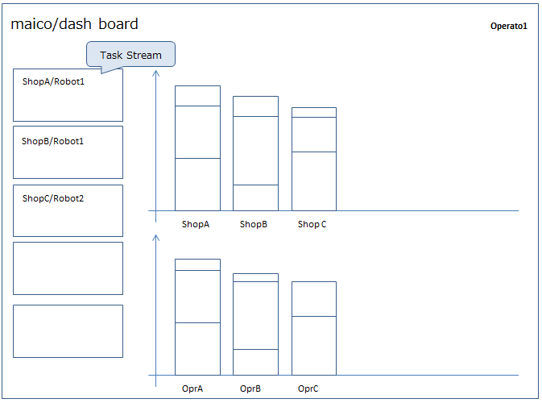
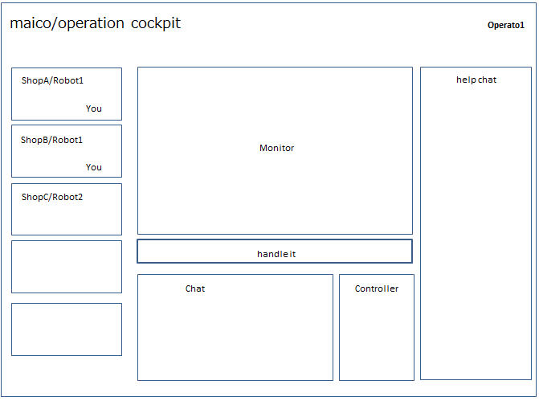

# maico documentation

## Architecture

**Components and Role**

* sensor(Kinect)
 * 来店した顧客の動きを捉え、local terminalに転送する
* local terminal(PC)
 * 受け取ったセンサー情報をsensing protocolにまとめ、Web Systemへ転送する
* Web system(maico) 
 * 受け取ったsennsing protocolを集約し、特徴量を作成する
 * action modelは、特徴量から取るべきactionを判定する
 * state modelは、特徴量から現在のstateを判定する
 * action/stateそれぞれの情報を、action protocolにまとめる
 * action protocolの内容を基に、ダッシュボードなどの表示を行う
 * Auto modeの場合action、Manual modeの場合ユーザーからの操作を、operation protocolにまとめる
 * operation protocolを、対象の店舗・ロボットへ送信する
* Dialogue System
 * One to Oneモードの時に対話の管理を行うシステム
* Robot(Pepper)
 * operation protocolに則り、発話やジェスチャーなどの行動を行う
 * Robot側にadapterを用意し、adapterはprotocolを解釈してRobotに適切な動作を行わせる
 * ユーザーから得られた反応などを、sensing protocolにまとめWeb systemに送信する

**protocols**

* sensing protocol(latency: 1req/sec~, channel:web socket)
 * (sensor_id): センサーのid情報。全店舗で一意のidがふられる(それがどの店舗にあるかはWeb Systemのマスタで管理)
 * _id: 検知したオブジェクトに振られる、一意のid
 * timestamp: 検知された自国のタイムスタンプ(%Y-%m-%d %H:%M:%S.%f)
 * feature{}: センサーで検知した情報を格納したディクショナリ
 * feature.__type__: 検知したオブジェクトのPythonクラス型情報
 * feature.attributes：検知したオブジェクトの観測情報(key/value)
* learning protocol
 * sensing protocolを内包する
 * prediction
 * feedback
* action protocol(仕様未定)
 * shop_id: お店のid
 * target_id: ターゲットのid
 * state: state modelから得られた、状態を表す離散値
 * action: action modelから得られた、行動を表す離散値
 * reward: 行動によって得られる報酬の見込み値
* operation protocol
 * sensor_id: 指示対象（Robot）のsensorのid
 * action: 下記のactionの種類を指定
 * operation: name/valueのdictionary
 * operation/utterance: 発話文
 * operation/gesture: ジェスチャー
 * operation/display: 表示画像
 * operation/move: 移動指示

stateの種類

* good: 良好な関係
* stable: 安定している
* breakdown: 破たんしている(音声認識エラーを含む)
* emergency: システムトラブルなど

actionの種類

* welcome: いらっしゃいませ
* one to many: 呼び込みモードの実行
* call: one to one に引き込むために声をかける
* engage: 対話モードを開始する/維持する
* one to one(auto): 自動応対モードの実行
* take over: 人での応対に切り替える
* one to one(manual): VRを利用した人による応対の開始
* terminate: one to oneを終了し、one to manyに遷移する

**Models**

Estimation

* action model: featureを受け取り、target_idに対しシステムが取るべきactionを決定する
* state model: featureを受け取り、target_idとの関係状態(state)を判定する

Generation

* operation model: action/stateを元に、実際のロボットの行動を生成する

## UI

* ユーザーは、「今何をすべきか」を即時に知ることができる
 * Task Streamを左側に配置し、緊急度が高い順に並べて表示
* ユーザーは、複数の案件について並行で対応することが可能
 * Cockpitでは、自分の扱っているタスクリストを参照できる
* ユーザーは、リモートでロボットを通じた接客が可能(テレプレゼンス)
* ユーザーは、問い合わせの全体状況を認識することができる
 * Dash boardに、店舗ごとのタスク状況、オペレーターごとのタスク進捗状況を表示する

