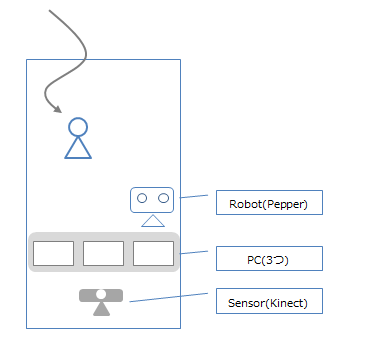

# Demo Scenario for First Action

## Objective

ロボットと人による共同接客のメリットを感じてもらう。  
これは、今後の共同実験先を開拓するために必要。そのため、現状できるところまでを見せるというよりは、コンセプトをきちんと理解してもらうことに重点を置く。

## Situation

パソコンショップを想定する。  
机の上に、3つのPCがあり、お客はその中から目的に合ったものを見つけたいとする。

## Script

* H: 人間(顧客)
* R: ロボット
* RR: ロボットを通じたリモート操作

### Case1: 自動応答で完結するパターン

* H: (店内に入ってくる)
 * R: いらっしゃいませ！どうぞご自由に見ていってくださいね
* H: (しばらくうろうろする)
 * R: (First Action発動) 商品のご説明をしましょうか?
* H: はい、お願いします (☆)
 * R: (3つのPCの紹介を、それぞれ一文ぐらいで行う)
 * R: ご予算はどれくらいですか?
* H: 10万円くらいです。
 * R: 動画や音楽の作成に使用する予定はありますか?
* H: いいえ、文章の作成が主です。
 * R: パソコンのセットアップはおひとりでできそうですか?
* H: いいえ、ちょっと不安です
 * R: それでしたら、こちらのPC(A)をおすすめします。文章の作成などなら十分なスペックで、何より購入後のアフターサポートが充実しています
* H: なるほど、ありがとう
 * R: どういたしまして

☆: 自動応対のプログラムに入るポイント。フレーム型の対話を行う。

### Case2: 人に対応を引き継ぐパターン

* H: (店内に入ってくる)
 * R: いらっしゃいませ！本日もご来店ありがとうございます
* H: (しばらくうろうろする)
 * R: (First Action発動) 商品のご説明をしましょうか?
* H: このPCってCore i7入ってる? 
 * R: 少々お待ちくださいね・・・(★)
 * RR: はい、入っています
* H: メモリは?
 * RR: 8Gと16Gのモデルがあります。現在ご使用のPCで問題なければ、同じメモリ容量で十分と思いますよ。
* H: なるほど、ありがとう
 * RR: どういたしまして

★: リモート応答に入るポイント。
